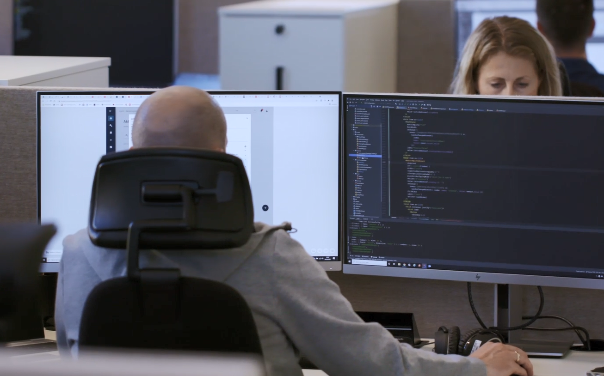

# javazone2022

Repoet har innhold til JavaZone 2022.

## Dagens oppgave

### torsdag 8. september

_Det var overskyet på Ørje i dag, så prøver derfor igjen i morgen over grisebukta kl. NY 11. Hvis alt går som planlagt har du pepper til middagen i morgen kveld._

**Svar**: _Det var tollkontroll på Ørje_ (sol=klart, overskyet=kontroll) _derfor prøver vi igjen i morgen over Svinesund_ (grise-bukta) _kl. 17_ (11:00 New York tid, 6t før norsk tid) _Hvis alt går som planlagt har du amfetamin (pepper er slang for amfetamin) ved middagstider_

### onsdag 7. september
_Hvis det er sol ved 69.6583269 30.2037012 dagen før bursdagen vår, så kommer jeg over med brusen_

**Svar**: _Hvis det ikke er tollkontroll_ (sol=klart) _ved Storskog grensestasjon_ (jf. GPS-koordinater) _16. mai_ (dagen før 17. mai, jf. bunadsbildet) _så kommer jeg over med kokainen_ (brus ... coke)

## Jobb?

Vi trenger flere flink folk til løsningene våre!  Se [karrieresiden vår for IT](https://jobb.toll.no/go/IT/8721002/)!

[Se video: ](https://player.vimeo.com/video/668593403?dnt=1&autoplay=false)

## Presentasjonene våre i 2021
* [Da EU bydde opp Tolletaten til dans](https://2021.javazone.no/#/program/ce228d9b-f468-4364-b7c0-30b1cec90ef3) ved Hilde Visthoff Drange og Kristine Sæhlie, onsdag 13:30
> De mest fremgangsrike landene i verden har alle minst èn ting til felles – et velfungerende tollsystem som sikrer etterlevelse av lover og regler for grensekryssende vareførsel. En rivende teknologisk utvikling, økt globalisering og fremveksten av nye handelsplattformer og distribusjonsmåter endrer imidlertid forutsetningene for hvordan tollmyndigheter over hele verden velger å løse samfunnsoppdraget. I Norge har vi tatt kravene til omstilling på dypeste alvor. Med produkttankegang, tverrfaglige team og smidig metodikk er Tolletaten nå på hugget for å utvikle morgendagens offentlige sektor.
Dette tankesettet ble imidlertid satt kraftig på prøve da Tolletatens smidige utviklingsprinsipper møtte EUs mastodontiske fossefallstilnærming, rigide kravspesifikasjoner og lovfestede tidsfrister i arbeidet med å få opp elektronisk forhåndsvarsling av varer fra tredjeland (ICS2). En svært omfattende operasjon som innebar at 29 land innenfor den europeiske sikkerhetssonen skulle koble seg på EUs fellesløsning for å kunne motta og risikovurdere forhåndsinformasjon om gods som skal passere EUs yttergrense. Da arbeidet startet opp var utfordringene betydelige, spørsmålene mange og fristene knappe. Mandag 15. mars gikk løsningen likevel på lufta i henhold til plan. Dermed kunne Norge ivareta sine internasjonale forpliktelser gjennom Sikkerhetsavtalen.
Dette er fortellingen om hvordan Tolletaten rigget seg for å møte en av de største samarbeidsutfordringene i nyere europeisk digitaliseringshistorie.

* [1 arkitektur med 2 ansikter – Janus i 12](https://2021.javazone.no/#/program/5ebc16af-b0f2-4f3d-8228-ff5dc5644d94) ved Lars Reed, Gyrd Norvoll, onsdag kl 12:10
> Tolletaten hadde for få år siden IT-løsninger dominert av aldrende, monolittiske applikasjoner. Vi har nå løsninger som i stor grad er «state of the art», med to dominerende løsningsmønstre for to kategorier av problemer. Vi så at løsningene våre falt i to kategorier: 1. det hendelsesdrevne, f.eks. at et bilskilt dukker opp på grensen eller at en pakke er på vei i posten og 2. det analytiske, der vi, basert på det vi har erfart av tidligere hendelser forsøker å forbedre våre kontroller, så vi bruker tid på det som er verdt å bruke tid på.  Dette har vi videreført i to ulike måter å lage løsninger på – med en, ofte tidskritisk, hendelsesdrevet verdikjede, og et analytisk domene som tar seg bedre tid til å forstå og lære. Det hendelsesdrevne er dominert av mikrotjenester, Kafka og rendyrking av hendelser som kommunikasjonsform. Det analytiske med verktøy for data pipelines, dataanalyse, etterretning, rapportering og statistikk.

